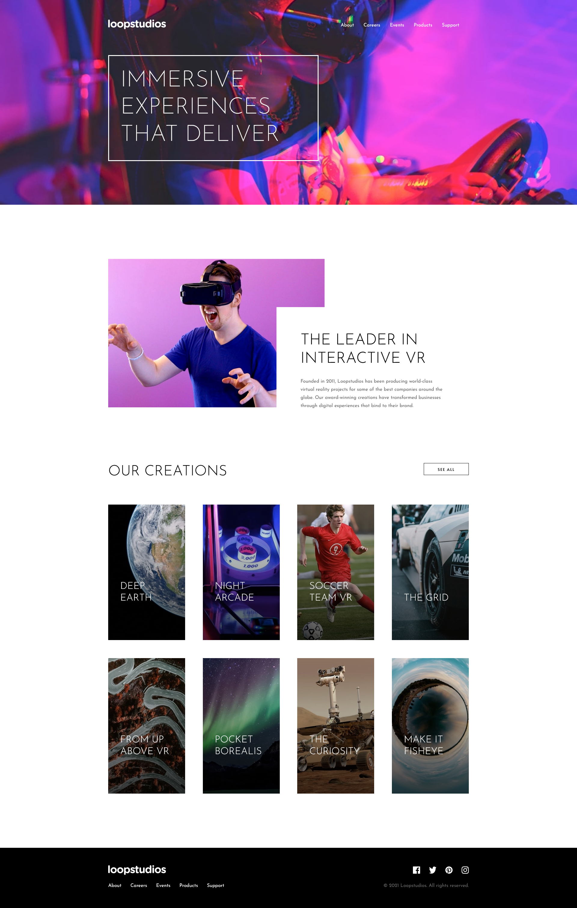
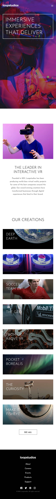

# Frontend Mentor - Loopstudios landing page solution

This is a solution to the [Loopstudios landing page challenge on Frontend Mentor](https://www.frontendmentor.io/challenges/loopstudios-landing-page-N88J5Onjw). Frontend Mentor challenges help you improve your coding skills by building realistic projects.

## Table of contents

- [Overview](#overview)
  - [The challenge](#the-challenge)
  - [Screenshot](#screenshot)
  - [Links](#links)
- [My process](#my-process)
  - [Built with](#built-with)
  - [What I learned](#what-i-learned)
  - [Useful resources](#useful-resources)
- [Author](#author)

**Note: Delete this note and update the table of contents based on what sections you keep.**

## Overview

### The challenge

Users should be able to:

- View the optimal layout for the site depending on their device's screen size
- See hover states for all interactive elements on the page

### Screenshot

### Links

- Solution URL: [Solution URL](https://github.com/imandreans/loopstudios-landing-page-main)
- Live Site URL: [Live Site URL](https://imandreans.github.io/loopstudios-landing-page-main/)

## My process

### Built with

- Semantic HTML5 markup
- Flexbox
- Grid
- Mobile-first workflow
- SCSS

### What I learned

I've learned to use SCSS for styling and use its syntax for looping.

### Useful resources

- [SCSS Documentation](https://sass-lang.com/install/) - This is a good start to install and learn SCSS

## Author

- Website - [Andrean](https://my-portfolio-gules-seven.vercel.app/)
- Frontend Mentor - [@imandreans](https://www.frontendmentor.io/profile/imandreans)
- Twitter - [@imandreans](https://www.twitter.com/imandreans)
